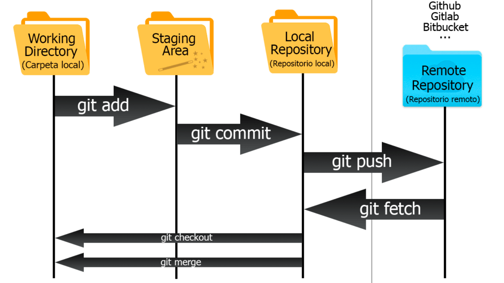
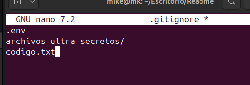
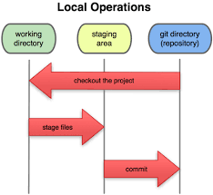

# Trabajo Individual

Miguel Angel Coca Espinoza

## Clase 1

### Que es GIT?

Es un sistema de control de versiones
Basicamente para guardar cambios a lo largo de un proyecto de forma local

### Como nacio GIT?

Git nacio porque Linus Torvalds al estar usando BitKeeper se canso de las limitaciones que le imponian,
asi que del coraje el lo que hizo fue crear su propio sistema de control de versiones
lo cual le tomo unas 2 a 3 semanas y ya lo tenia listo.

### Como instalar GIT?

Para instalarlo lo unicio que se debe hacer es ingresar a la pagina de GIT https://git-scm.com/ 
en el cual debes seleccionar si lo descagaras para Windows, Linux, Mac OS en le caso de Windows solo es cuestion de descargar el instalador
pero en el caso de linux te da una serie de comandos que varian segun a la DISTRO que tengas
para ya luego tener GIT listo para su uso.

### Configuraciones Basicas

-git config --global user.name "Tu Nombre"
-git config --global user.email "tu@correo.com"
-git config --global core.autocrlf true

### Archivos que todo repositorio de GIT deberia tener

README.md 

.gitignore
 

## Clase 2 

### Los estados de GIT

 

#### Directorio de trabajo (Modificado)

La carpeta local, pero no esta asegurado

#### Stage Area (Preparado)

El punto intermedio de el directorio y el repositorio
en el cual va lo que si quiero guardar

#### Repositorio Local (Confirmado)

Todos los cambio con ID (hash) uqe ya esta asegurado

### Directorio de trabajo (Modificado)  

Es la carpeta comun pero bajo la observacion de GIT y cataloga en:

#### Untracked

Significa sin seguimiento pero no hay una version anterior esto suele pasar cuando recien son creadas.

#### Modified 

Significa que en este caso GIT ya tiene una version previa de tu archivo pero lo modificaste, cambiaste nombre o eliminaste.

Archivo que no este en el .gitignore se procedera a su catalogacion ya sea Untracked o Modified 

Cuando quiero que un archivo modificado anteriormente vuelva a su estado original se usa:
git restore <archivo>
Nota: Borra todo fisicamente por lo que no se podra recuperar 

En el caso en el que un archivo que cree no quiero que GIT lo vea:
Lo que debo hacer es agregar el nombre completo del archivo al .gitignore 

### Stage Area (Preparado)

Este nos permite seleccionar que archivos tendran seguimiento del commit 

git add <archivo>: Esto nos permite agregar uno por uno
git add .: Este agrega todos los archivos observados por GIT

Para sacar archivo del stage a un estado anterior

git restore --staged <archivo>

### Repositorio Local (confirmado)

Para crear un commit o punto de guardado se debe poner lo siguiente:

git commit -m "mensaje"

y para deshacer el ultimo commit es:

git reset --soft HEAD~1

### Buenas Practicas

####Cuando debo hacer un commit?
Se usara lo que es los commits atomicos, las confirmaciones seran de cada cambio o acciones importantes pero pequeñas y que tengan un significado.

### Escribir Buenos commits

Se deben usar pocas palabras pero efectiva:
#### Usar verbos imperativos (Add, Change, Fix, Remove)
-Add: Añadir un nuevo archivo 
-Change: indica una modificacion de un archivo
-Fix: Es para un arreglo de un Bug
-Remove: Cuando se elimina un archivo ya existente

#### No usar punto final ni puntos suspensivos en un mensaje de commit

(Mal) git commit -m "Add new search feature."
(Mal) git commit -m "Fix a problem with topbar..."
(Bien) git commit -m "Change the default system color"

### Escribe buenos commits'

-Usa como maximo 50 caracteres: El mensaje debe ser corto, objetivo y claro y solo debe tener un cambio y si se puede separar hazlo.
-Usa un prefijo para tus commits para hacerlos mas semanticos: Para que sea mas entendible de que se tratara el commit y de que trata

git commit -m "<tipo de commit>: <descripcion>"
ejm
git commit -m "feat:Add mew search feature"

### Prefijos
- feat: para una nueva caracteristica agregada.
- fix: para un bug que afecta a nuestro usuario.
- perf: para cambios que mejoran el rendimiento.
- build: para cambios del sistema.
- ci: para cambios en la integracion.
- docs: para cambios en la documentacion.
- refactor: para cambios de nombre en variables o funciones.
- style: para cambios de formato, tabulaciones o cosas que no afectan a usuario.
- test: para test o refactorizacion de uno ya existente.

### Añade todo el contexto que sea necesario en el cuerpo del commit 
-En el caso en el que necesites agregar un mensaje mas largo se debe hacer lo siguiente:

git commit

prefijo: Titulo de tu commit

Cuerpo que describe tu commit

## Clase 3

## GITHUB Y SSH

### Que es GITHUB?

Es una plataforma online para almacenar y comparitr codigo usando GIT.
 
### Diferencioa entre GIT y GITHUB

La principal diferencia es que GIT controla las versiones en tu PC mientra que GITHUB guarda las versiones de manera online.

### SSH y HTTPS

SSH: Solo se necesita una autenticacion lo cual resulta mas facil
HTTPS: Al clonar un repositorio en HTTPS nos pedira la autenticacion cad vez o un token lo cual lo hace menos eficiente.

### Configuracion SSH

En la terminal ejecutamos los siguientes comandos:

ssh-keygen -t ed25519 -C "tu-correo@email.com"
cat ~/.ssh/id_ed25519.pub

Luego copias lo que sale y en tu perfil de github a settings, ssh,GPG Keys, New ssh key" pegas la key, le asignas nombre a tu pc y luego en add

ssh -T git@github.com

### Crea tu repositorio en GITHUB

En la parte de repositorios presionas TAB y presionas "New"

Nombras a tu repositorio y luego en create repository

### Conectar el repositorio local de GIT con uno Github

git remote add origin git@github.com:TuUser/TuRepo.git

git brnch -M main
git push -u origin main

### Clonar un repositorio de GIT

git clone "git@email.com:TuUser/Tu Repo.git"

Si esta en https: 
git clone "https://github.com/TuUser/TuRepo.git"

Para cambiar el puntero de git y que no pide autenticacion cada momento.
git remote set-url origin "git@github.com:TuUser/TuRepo.git"	
Tambien sirve para cambiar el repositorio remoto al que esta conectado el repositorio.

Para ver a que repositorio remoto esta conectada tu repo:
git remote -v

### Cambios

#### Subir mis cambios

git push origin <rama>

git push: "Empujar" commits
origin: Al servidor llamado origin
<rama>: A la <rama> de mi codigo

####Bajar cambios hechos

git pull origin <rama>

git pull:Traer commits del servidor
origin: del servidor origin
<rama>: La <rama> de mi codigo

## Clase 4

### GIT remote

Este nos permite tener conexion con un repositorio remoto dandole las indicaciones de donde mandar o traer la informacion 
Algunos comandos usados son:
-git remote -v(Poder ver las URLs que apunta nuestro repo.
-git remote add <apodo>"url"(Vincula nuestro repo local con el repositorio remoto)
-git remote set-url <apodo>"url"(Cambio de url)

### Multiples SSH

En el caso en el de tenere mas de una cuenta de github o necesitar tenere otras se necesitara una llave para cada una 

### Configurar multiples SSH

#### Paso 1

Generar el sshkey con distinto nombre
ssh-keygen -t ed25519 -C
"micorreo@gmail.com" -f ~/.ssh/id_miname
#### Paso 2
Crear un archivo config para que no chequen las Keys
-Cuenta Personal()
 Host github.com
   HostName github.com
   Usergit
   IdentifyFile ~/ssh/id-ed25519
-Cuenta del otro correo 
 Host github.com
   HostName github.com
   User git
   IdentifyFile ~/ssh/id_miname
*Host: Es el sobre nombre de la conexion (git@Host)
*Hostname: Es la direccion real del servidor a donde nos conectaremos (github.com)
*User: Es el nombre de usuario de github (git.)
*IdentifyFile: Es la ruta exacta de la llave que quieres usar para ese host

#### Paso 3

Para verificar su funcionalidad se ejecuta el siguiente comando: 
ssh -T git@github-miname

### Configuraciones locales 

git config user.name"Mi nuevo name"
git config user.email"micorreo@gmail.com"

Nota: Hacer GIT CLONE con el host correcto 
git clone git@github-miname:usuario/repo.git

### Git Checkout

Este nos permite movernos entre:

Commits(viajes al pasado)
Ramas(Cambiar de linea de trabajo)
Archivos(restaurarlos)

El estado "Detached HEAD"
El estado desacoplado apunta hacia un commit y no a la rama

-Ver hacia un commits viejo
-Pero no puedes hacer cambios ahi
-Al salir tus pruebas desaparecen

### Como ir y volver de un commit?

Para retroceder
git checkout <hash_antiguo>
para volver al ultimo hash de la rama 
git checkout <rama>

Si hiciste un commit este desaparecera a menos que hagas 
git checkout <hash_commit_creado>
git checkout -b rama_nueva

### Buenas practicas del check out

#### No usar mucho tiempo 'Deteched HEAD'
Si haras mas de dos lineas preferiblemente crea una rama nueva
#### Limpia tu directorio de trabajo 
Antes de hacer esto crea un commit o no podras hacerlo
#### Usalo solo para aprender
Esto es para entender como se crearon

